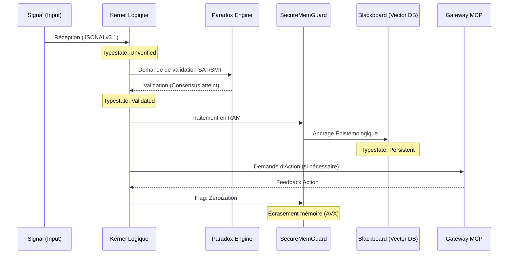

# 🏛️ Vue d'Ensemble de l'Architecture R2D2

L'architecture s'aligne strictement sur les principes Héxagonaux (Ports et Adaptateurs), garantissant que le `Kernel Logique` ("Core Domain") ne dépende d'aucune infrastructure externe.

## Diagramme des Interactions (Ruche)

## Les 3 Piliers de l'Architecture

1. **Isolation de la Logique (Hexagonale) :** Les dépendances pointent toujours vers l'intérieur. Le `Paradox Engine` (la vérité) ne doit jamais dépendre du moteur d'inférence BitNet (le moyen).
2. **Le Cycle de Vie "Typestate" :** Impossible à tricher. Un fragment d'information ne peut être persistant sans la signature cryptographique du Kernel.
3. **Throttling Prédictif (Digital Twin) :** Couplage profond au matériel hôte. Si le GPU atteint la limite critique, le système bascule le processus sur le CPU pour la survie du Nœud.
