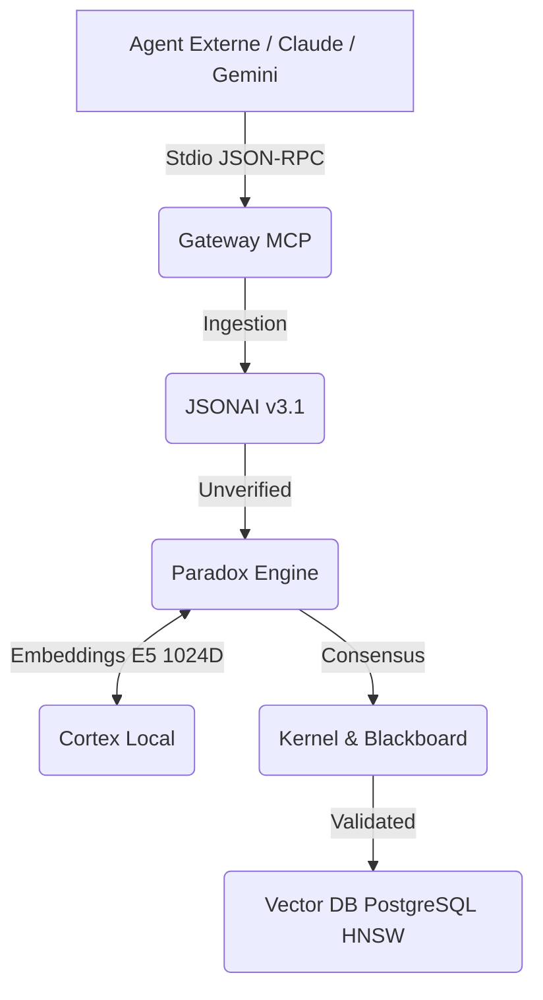

<div align="center">

# 🛡️ R2D2 : L'ÉCOSystème Cognitif Souverain

[](https://github.com/r2d2-forge/r2d2-core/actions/workflows/ci.yml)
[](https://www.rust-lang.org)
[](#license)
[](#status)

**Architecture d'un Essaim Décentralisé, Ternaire et Auto-Financé**

[Architecture & Livre Blanc](./DEV_DOCS/LIVRE_BLANC.md) • [Contribuer](./CONTRIBUTING.md) • [Roadmap](./DEV_DOCS/ROADMAP.md)

</div>

---

## 🚀 Le Projet R2D2

R2D2 n'est pas une simple itération de LLM. C'est un **Système d'Exploitation Cognitif (COS)** bâti sur trois piliers intransigeants :

1. **La Vérité comme Infrastructure :** Fini le probabilisme et les hallucinations. Le "Paradox Engine" valide sémantiquement chaque fragment via le standard `JSONAI v3.1`. Rien n'est exécuté sans preuve.
2. **La Rupture de l'Inférence Ternaire (BitNet b1.58) :** Destructuration du *Memory Wall*. Remplace les multiplications flottantes par de simples accumulations. Fait tourner des essaims de 15 agents critiques simultanément sur des machines grand public (L40s, RTX 3060).
3. **Souveraineté et Sécurité "Zero-Trust" :** Écrit en Rust. `SecureMemGuard` et *Zeroization* physique de la RAM (SIMD AVX-512) après chaque inférence pour bloquer le Memory Scraping.

Si vous cherchez un "wrapper API" vite fait, vous êtes au mauvais endroit. Si vous voulez forger la nouvelle épine dorsale inviolable de l'I.A. souveraine, **bienvenue dans la Ruche.**

---

## 🛠️ Onboarding Express (Zero-Config)

Nous avons conçu l'expérience développeur (DX) pour être aussi fluide qu'exigeante. 

### Pré-requis
- [Rust](https://rustup.rs/) (Édition 2021)
- Git

### Compiler en 3 lignes

```bash
git clone https://github.com/r2d2-forge/r2d2-core.git
cd r2d2-core
cargo test --workspace
```
> **Note :** Le dépôt est structuré en *Virtual Workspace*. Les Briques fondatrices sont déjà opérationnelles :
> - `r2d2-secure-mem` (Brique 0) : Zeroization de la RAM.
> - `r2d2-jsonai` (Brique 1) : Standard de Représentation Sémantique v3.1.
> - `r2d2-kernel` (Brique 2) : Formalisme par Typestate Strict.
> - `r2d2-paradox` (Brique 3) : Moteur de Preuve d'Inférence Anti-Hallucination.
> - `r2d2-cortex` (Brique 4) : Moteur Tensoriel Local (Candle) chargeant `Multilingual-E5-Small` avec Zero-Padding 1024D.
> - `r2d2-blackboard` (Brique 7) : Indexation PostgreSQL vectorielle HNSW.
> - `r2d2-mcp` (Brique 9) : Gateway Native JSON-RPC sur Stdio (Zéro Dépendance réseau).

---

## 🧠 Doctrine d'Ingénierie (Staff-Level Requirement)

Notre code est critique (Défense, Finance, Systèmes Souverains). Lisez attentivement le [CONTRIBUTING.md](./CONTRIBUTING.md) avant votre première PR. Les règles d'or :

1. **Typestate Pattern Absolu :** Un état invalide `Unverified` ne doit *jamais* compiler avec une fonction nécessitant un état `Validated`.
2. **0 `unwrap()` / 0 `panic!()` :** Toute erreur est traitée, tracée (`tracing`) et renvoyée formellement via `thiserror` et `anyhow`.
3. **Zero-Trust Memory :** Si vous manipulez des poids de modèles ou des données utilisateurs, elles doivent transiter par les sandbox de la Brique 0 (Hyperviseur).

---

## 🗺️ Architecture de Haut Niveau

L'essaim R2D2 est un agencement modulaire strict de 14 Briques. L'intégration récente du Cortex (Tensor/Local) et de la Gateway MCP rend le système autonome et sécure.



---

## 🔌 Intégration LLM / Éditeur (Guide MCP)

Vous pouvez lier **n'importe quel agent d'IA** (Claude Desktop, Cursor, Gemini) à R2D2 via le protocole ouvert MCP (Model Context Protocol). L'Essaim tournant sous WSL, le pont Windows/Fedora est natif, étanche, et sans latence HTTP !

Pour donner la mémoire absolue à votre IA, ajoutez ceci à votre fichier `mcp_config.json` (Ex: `%APPDATA%/Claude/claude_desktop_config.json` ou `~/.gemini/mcp_config.json`) :

```json
{
  "mcpServers": {
    "r2d2-blackboard": {
      "command": "wsl.exe",
      "args": [
        "--",
        "bash",
        "-c",
        "cd /mnt/d/VOTRE_CHEMIN/R2D2 && source ~/.cargo/env && RUST_LOG=info cargo run -q -p r2d2-mcp"
      ]
    }
  }
}
```

Redémarrez votre éditeur, et voici les pouvoirs débloqués :
- `anchor_thought` : Fait glisser la réflexion de l'IA vers le moteur tensoriel E5 puis dans PostgreSQL.
- `recall_memory` : Effectue un *Similarity Cosine Search* dans le Blackboard à vitesse maximale pour exhumer toute architecture passée.

---

## 📜 Licence

Ce projet est distribué sous double licence MIT et Apache 2.0 au choix. Voir les fichiers `LICENSE-MIT` et `LICENSE-APACHE`.
L'infrastructure de financement décentralisée par preuve d'inférence (PoI Tax 1%) est intégrée au protocole.

<div align="center">
  <i>Document certifié par l'Essaim R2D2 - Épuration Sémantique Validée</i>
</div>